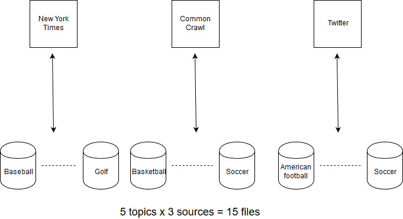
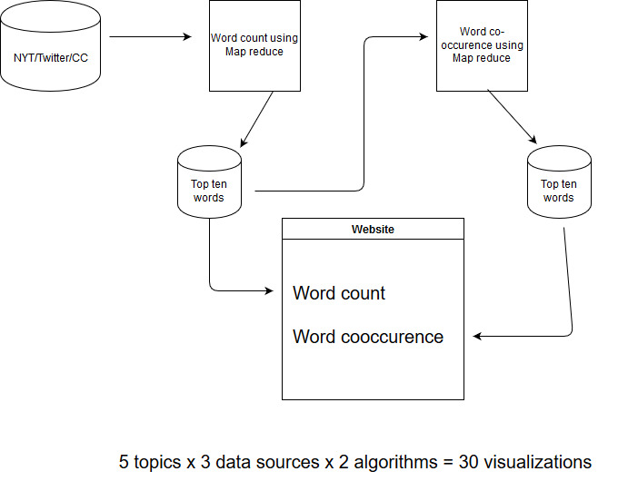

<h1 style="text-align: center">CSE 587 - Lab 2 report</h1>
<h2 style="text-align: center">Data Aggregation, Big data analysis and Visualization</h2>

## Submitted by:

#### Saketh Varma, Pericherla - sakethva - 50288206

#### Aditya Vikram, Parakala - aparakal - 50289171

## Topic: Sports

The topic that we chose for this lab is Sports and our sub-topics are:

- Baseball
- Basketball
- Soccer
- Golf
- American Football

**For each sub-topic** we have collected around 300 to 800 New york times articles, 10000 to 15000 tweets and crawled through 2000 articles from ESPN using common crawl. This totals upto 4000 NYT articles, 65000 tweets and 10,000 hits from common crawl for the entire topic.

## Instructions:

- Create a new virtual environment. If you are using anaconda use

  ```shell
  $ conda create --name env_name
  ```

- Activate the created environment

  ```shell
  $ conda activate env_name
  ```

- The project already comes with a requirements.txt file so use the below command to install all the project dependencies

  ```shell
  $ pip install -r requirements.txt
  ```

- Create a `.env` file in the root of the project and store secrets like TWITTER_CONSUMER_KEY, NYTIMES_API_KEY etc
- Type python on the command line and type the following commands to install nltk packages:
  ```shell
  C:\Users\socket_var\Desktop\dic>python
  Python 3.7.3 (default, Mar 27 2019, 17:13:21) [MSC v.1915 64 bit (AMD64)] :: Anaconda, Inc. on win32
  Type "help", "copyright", "credits" or "license" for more information.
  >>> import nltk
  >>> nltk.download("wordnet")
  >>> nltk.download("stopwords")
  >>>
  ```
- To get the website up and running install the npm package called `serve` by using the command:
  ```shell
  $ npm install serve -g
  ```
- Now go to `Website` folder and just type
  ```shell
  $ serve
  ```
- Head over to [http://localhost:5000](http://localhost:5000) and browse through the visualizations.
- Alternatively, head over to [https://cse587-viz-kxodrdissk.now.sh/](https://cse587-viz-kxodrdissk.now.sh/) which is the live version of this site.

## Data collection:

The below flow chart summarizes the data collection logistics:



### New York Times:

Data from new york times is collected using the following snippet which queries the new york times API and returns a list of records containing URLs and many more. Note that we are getting only articles that are published in 2019 using the `fq` property.

```python
params = {'q': 'american+football',
          'api-key': nytimes_key, 'page': 0,
          'fl': '_id,web_url,pub_date,document_type,head_line,news_desk,source,subsection_name,snippet',
          'fq': 'pub_year:2019'
         }
```

### Common Crawl:

Using the below snippet, we query the common crawl endpoint for an index in 2019 - for example `index_list = ["2019-13", "2019-09", "2019-04"]`. We also provide the target URL to get the data from - for example `http://www.espn.com/golf/story/*`

```python
record_list = []

for index in index_list:

    cc_url = "http://index.commoncrawl.org/CC-MAIN-%s-index?" % index
    cc_url += "url=%s&output=json" % domain

    response = requests.get(cc_url)

    if response.status_code == 200:

        records = response.content.splitlines()

        for record in records:
            record_list.append(json.loads(record))
```

### Twitter:

- We use the `tweepy` library and provide the corresponding API keys for twitter. We extract about 15,000 tweets for each sub-topic using the following snippet:

```python
searchQuery = "nfl OR #nfl OR american football OR #americanfootball -filter:retweets"

def limit_handled(cursor):
    while True:
        try:
            yield cursor.next()
        except tweepy.RateLimitError:
            time.sleep(15 * 60)
        except StopIteration:
            print("End of iterations reached")
            break

for record in limit_handled(tweepy.Cursor(api.search, q=searchQuery).items(15000)):
    records.append(record._json)
```

- Notice that we use the flag `-filter:retweets` to eliminate retweets corresponding to the source tweet.

## Data cleaning and processing:

Once the data is collected into the csv files, the text is extracted and is further stored in text files.

### New York Times:

- We use beautiful soup to crawl the page and get the text using the below snippet. Notice how specific we are when choosing the target components using the CSS selector `main#site-content article#story section div.StoryBodyCompanionColumn > div > p`.

  ```python
  http = urllib3.PoolManager()

  text = ""
  for url in df:

      response = http.request('GET', url)

      soup = BeautifulSoup(response.data, 'html.parser')

      matches = soup.select("main#site-content article#story section div.StoryBodyCompanionColumn > div > p")
      for item in matches:
          text += item.get_text()+"\n"
  ```

- Note that the paragraphs are seperated by the new line character.

### Common Crawl:

- Using the filename column in the obtained records we send an HTTP request to get the corresponding gzipped WARC file and extract it to get the target URLs.
- Then we use beautiful soup to crawl the web page and get the data.
- We use the espn.com URLs to crawl using the following unique CSS selector `section > article:first-child > div.container > div.article-body > p`.

### Twitter:

- Recall that we have already excluded retweets during the data collection.
- In the processing stage we use the following snippet to remove duplicates if any. Note that this step needs the pandas library.

```python
df = df.drop_duplicates(subset="text", keep="first")
```

- We finally save the results a .txt file with each tweet seperated by a new line character.

## Hadoop workflow:

The below flow chart summarizes the process of performing big-data analysis for this lab:



- First, we start all hadoop processes in the Ubuntu Virtual machine provided for the lab using the command:

```shell
$ /home/cse587/hadoop-3.1.2/sbin/start-all.sh
```

- We then create a directory structure in HDFS. For example:

```shell
$ hadoop fs -mkdir /user/saketh/mr/input/twitter
```

- We copy the files from the local system to the HDFS. For example:

```shell
$ hadoop fs -put input/mr/nyt_* /user/saketh/mr/input/nyt
```

- We also create a directory for storing the map-reduce results in HDFS using the command:

```shell
$ hadoop fs -mkdir /user/saketh/mr/output/
```

- We finally run the word count algorithm on Hadoopas shown in the below snippet:

```shell
$ hadoop jar /home/cse587/hadoop-3.1.2/share/hadoop/tools/lib/hadoop-streaming-3.1.2.jar -file mapper_wordcount.py -mapper mapper_wordcount.py -file reducer.py -reducer reducer.py -input /user/saketh/mr/input/nyt/nyt_basketball.txt -output /user/saketh/mr/output/nyt
```

- Once successful the output files are transferred to local storage as follows:

```shell
$ hadoop fs -get /user/saketh/mr/output/ output/
```

- Note that the mapper files for both word count and co-occurence use the nltk library to filter the following content:

  - Punctuation
  - Numerals
  - URLs
  - Twitter hashtags and user names

- We use `filter_top_words.ipynb` to get the top ten relevant keywords from the word count results.

- We now move on to word co-occurence analysis where the input files would contain only the top ten words obtained from the word count algorithm.
- We clear the output folder on HDFS using the command:

```shell
$ hadoop fs -rm -r /user/saketh/mr/output/*
```

- Finally we use the following command to run the co-occurence algorithm:

```shell
$ hadoop jar /home/cse587/hadoop-3.1.2/share/hadoop/tools/lib/hadoop-streaming-3.1.2.jar -file mapper_cooccurence.py -mapper mapper_cooccurence.py -file reducer.py -reducer reducer.py -input /user/saketh/mr/input/wc/nyt_basketball.txt -output /user/saketh/mr/output/cooccurence/nyt
```

- Finally we use the same filter_top_words.ipynb file to save the top ten co-occuring words.

## Visualization using d3.js:

We use the d3.js library and the d3-cloud library to visualize the results using a word-cloud.

The website is also publicly available at [https://cse587-viz-kxodrdissk.now.sh/](https://cse587-viz-kxodrdissk.now.sh/)

### Example:

Below screenshots show the word clouds obtained using the d3.js library for the topic `Soccer`:

[]("./images/soccer_wc_nyt.PNG)
[]("./images/soccer_wordcount_twitter.PNG)
[]("./images/soccer_wordcount_commoncrawl.PNG)
[]("./images/nyt_cooc_soccer.PNG)
[]("./images/twitter_cooc_soccer.PNG)
[]("./images/commoncrawl_cooc_soccer.PNG")

## Observations:

### Baseball:

- Mets and the yankees have been popping up everywhere which shows the immense following they have apart from boston red sox, the dodgers, the rockies, the phillies and others on top of the word count analysis.
- Terms like home-run, hit-pitch confirm the heavy use of the terms together in baseball lingo. Also contract-million, deal-million show up frequently which shows that there is a lot of discussion on player contracts as expected along with pairs like red-sox, dodger-series etc.

### Basketball:

- Lakers and Lebron have poppped up consistently. Apart from that the raptors, celtics, cleveland, golden state and wnba have showed up consistently in the word count analysis.
- curry-nba, james-lakers have been the obvious player-team type of pairs apart from golden-state, cleveland-nba and many more team names.

### Soccer:

- Liverpool, Manchester United and Manchester City have showed up consistently in top words but Chelsea and Real madrid have also showed up in common crawl.
- chelsea-liverpool and other terms cooccuring with liverpool have been seen consistently which can be explained that liverpool being on top of the table has been getting a lot of attention. Apart from that champions-league has been trending since it is ongoing right now which explains why madrid-ronaldo madrid-real have been showing up all over.

### American Football:

- Much of the keywords around nfl have been around the draft, president trump - only in new york times - for bashing NFL players for kneeling during national anthem and the super bowl champions, the patriots. Aprt from that the raiders, the eagles and the steelers have been showing up consistently in the word count analysis.
- While new york times shows president-trump for the politics surrounding the nfl, seahawks-wilson, nfl-russell have been on the top apart from the draft related pairs like draft-quarterback, million-quarterback, contract-million have been on the top.

### Golf:

- Since tiger woods has won the masters and the fact that president trump likes to play golf they have been showing up heavily on all of the word clouds apart from golf lingo like hole, putt and club have been on the top.
- In the twitter word cloud, terms like taxpayer, mueller, limbaugh have been showing up with trump because people have been tweeting that trump is playing golf with limbaugh after mueller report has been publicized.
- While terms like augusta-wood, augusta-master, master-wood have been on the top because of the latest masters victory for tiger woods, limbuagh-trump, mueller-trump have been trending because of trump's recent visit to the golf course for Easter Sunday.

## References:

- https://github.com/jasondavies/d3-cloud
- https://www.bellingcat.com/resources/2015/08/13/using-python-to-mine-common-crawl/
- https://www.datacamp.com/community/tutorials/stemming-lemmatization-python
